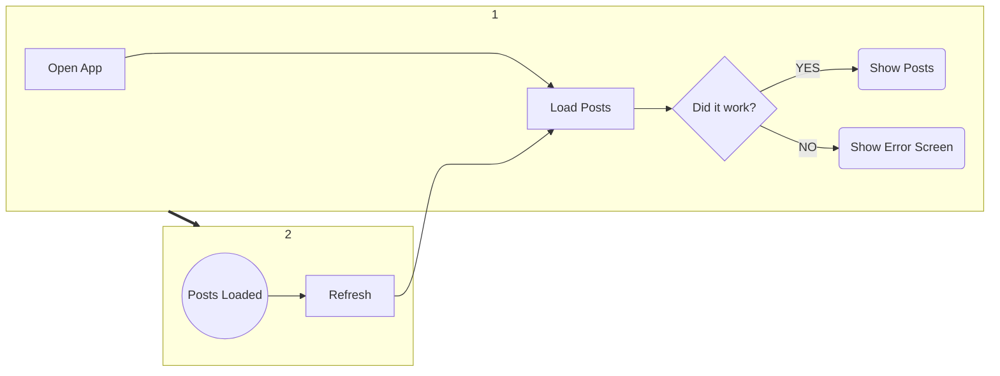

# Implement a post list

Created: March 31, 2022
Last Edited Time: April 4, 2022
Type: Project Kickoff 🚀

# Overview

On this proposal we are going to define the scope of the new feature we are going to design related with the main screen of the app and consist on showing a list of posts from this [API](https://jsonplaceholder.typicode.com)

### Problem Statement

- The current app does nothing and only shows a blank screen

### Proposed Solution

- Implement the main feature of the app that consist on showing up a list of posts from `https://jsonplaceholder.typicode.com`

# Success Criteria

- The app can be compiled with the expected use cases defined in [User Stories](#user-stories)
- All the tests are passed
- The total coverage of the feature is greater than 60%
- All the business layer is tested

# User Stories

1. The user can see a list of posts by just opening the app. The user will see a loading state each time the app loads some data

   
   
2. The user can make a forced refresh of the data (even if the data is the same)
3. If there is no data to show the app will show an empty screen with a message *“No posts to show”* no matter the type of the error.

# Scope

- Main screen of the app

### Requirements

- Unit tests
- Integration tests for the main posts flow
    - Success state
    - 500/404 code error
    - No connection error

### Non-Requirements

- Instrumentation tests
